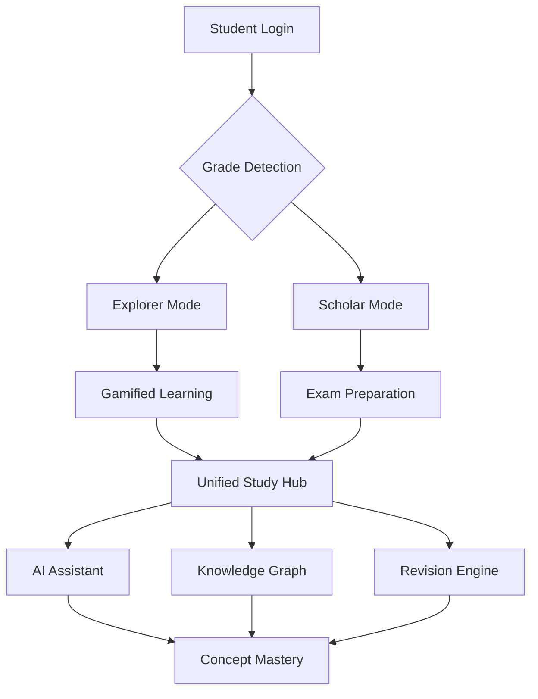

# 🚀 EduRoute: The Unified Learning Ecosystem

<p align="center"> 
  
</p>

<p align="center">


</p>

---

## 🎯 Vision

EduRoute is a next-generation educational ecosystem designed to eliminate fragmented learning experiences.

Instead of forcing students to switch between YouTube, PDFs, Notes Apps, Flashcards, and AI tools, EduRoute brings everything into one intelligent learning environment.

---

# 🛑 The Problem

### 🔄 Context Switching

Students constantly jump between:

- Video Lectures
- PDFs
- Notes
- Flashcards
- AI Assistants

This destroys deep focus and retention.

### 🎭 One Interface For Everyone

Most educational platforms give identical interfaces to:

- Grade 6 Students
- Grade 12 Students

Despite having completely different learning requirements.

### 😴 Passive Learning

Most platforms optimize for:

❌ Watch Time

❌ Completion Rates

Instead of:

✅ Understanding

✅ Recall

✅ Mastery

---

# 💡 The Solution

EduRoute dynamically adapts itself based on the student's academic level.

```text
       [Student Grade Configuration]
                    │
         ┌──────────┴──────────┐
         ▼                     ▼

┌─────────────────┐   ┌─────────────────┐
│  GRADES 6–8     │   │  GRADES 9–12    │
│ Explorer Mode   │   │ Scholar Mode    │
├─────────────────┤   ├─────────────────┤
│ • Gamification  │   │ • Exam Focused  │
│ • Missions      │   │ • Deep Focus    │
│ • Rewards       │   │ • Sprint Study  │
└────────┬────────┘   └────────┬────────┘
         └──────────┬──────────┘
                    ▼

┌─────────────────────────────────────┐
│          EDUROUTE CORE              │
├─────────────────────────────────────┤
│ • Study Hub                         │
│ • AI Assistant                      │
│ • Knowledge Graph                   │
│ • Revision Engine                   │
└─────────────────────────────────────┘
```

---

# 🏗️ Architecture



---

# ✨ Core Features

## 📚 Curriculum-Aligned Learning Ecosystem

Comprehensive platform helping students master academic subjects through:

- Smart Notes
- Interactive Summaries
- Concept Maps
- Multimedia Explanations

---

## 🧠 Concept-Driven Content Delivery

Transforms dense textbook chapters into:

- Crisp Documentation
- Visual Learning Paths
- Interactive Cards
- Revision Snapshots

---

## 🤖 AI-Powered Learning Assistant

24/7 AI Companion capable of:

- Answering doubts
- Explaining concepts
- Simplifying difficult terminology
- Personalized study hints
- Context-aware support

---

## 🎥 Integrated Multimedia Solutions

Every concept is supported by:

- Bite-sized Lectures
- Video Explanations
- Problem Walkthroughs
- Textbook Solution Videos

---

## 🔀 Dual-Channel Learning Pathway

Students can simultaneously:

📖 Read Concepts

AND

🎥 Watch Explanations

Inside a single workspace.

---

# 🏠 Study Hub

The central workspace of EduRoute.

```text
┌─────────────────────────────────────────────────────────┐
│                    VIDEO LESSON                         │
├──────────────┬──────────────────────┬───────────────────┤
│              │                      │                   │
│ Navigation   │ Notes & Content      │ AI Assistant      │
│              │                      │                   │
└──────────────┴──────────────────────┴───────────────────┘
```

Everything needed for learning exists in one screen.

No tab switching.

No context loss.

---

# 🧠 Active Recall System

Unlike traditional platforms, EduRoute is designed for retention.

### Features

- Flashcards
- Blur-to-Recall Notes
- Rapid Revision
- Spaced Repetition
- Knowledge Mapping
- Exam Sprint Mode

---

# 🕸️ Knowledge Graph

EduRoute automatically connects concepts.

```text
Photosynthesis
      │
      ▼
Plant Cells
      │
      ▼
Cell Organelles
      │
      ▼
Respiration
```

Helping students understand relationships across chapters.

---

# 🎮 Grade-Adaptive Learning

## Explorer Mode (Grades 6–8)

- Gamified Learning
- Mission-Based Progress
- Achievement Badges
- Interactive Journeys
- Reward Systems

## Scholar Mode (Grades 9–12)

- Deep Focus Interface
- Competitive Exam Prep
- High-Density Learning
- Revision Sprints
- Performance Analytics

---

# 🚀 Roadmap

### Phase 1

- Study Hub
- AI Assistant
- Notes Engine
- Video Integration

### Phase 2

- Flashcards
- Knowledge Graph
- Revision Modes
- Progress Analytics

### Phase 3

- Adaptive Learning Paths
- AI Tutor Agents
- Competitive Exam Suite
- Predictive Performance Models

---

# 🛠️ Tech Stack

```yaml
Frontend:
  - React.js
  - Next.js
  - Tailwind CSS

Backend:
  - Node.js
  - Express.js

Database:
  - PostgreSQL
  - MongoDB

AI:
  - OpenAI API
  - RAG Pipeline

Cloud:
  - AWS
  - Vercel
```

---

# 🌟 Long-Term Goal

EduRoute aims to become the operating system for student learning.

One Platform.

One Workflow.

One Focus.

From middle-school exploration to competitive-exam mastery.

---

<p align="center">
  
</p>
